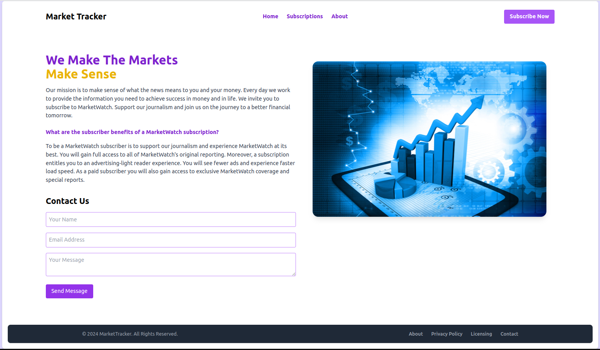
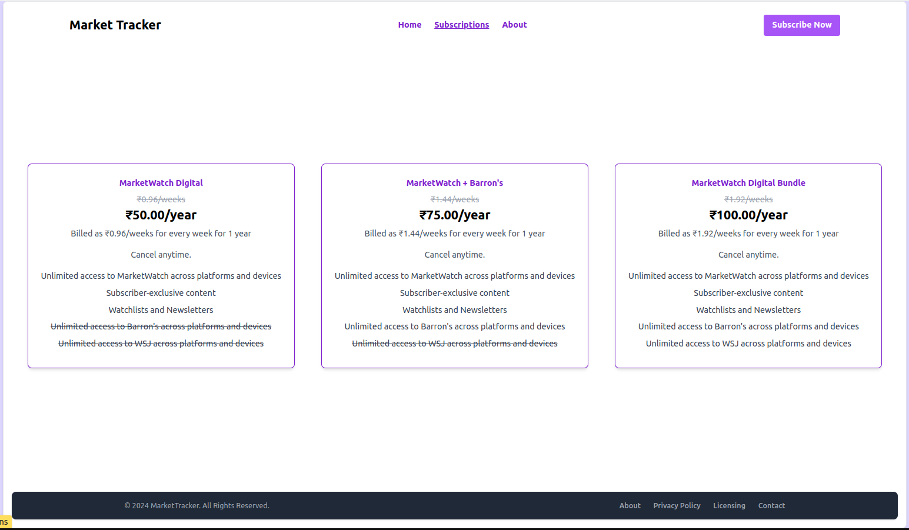
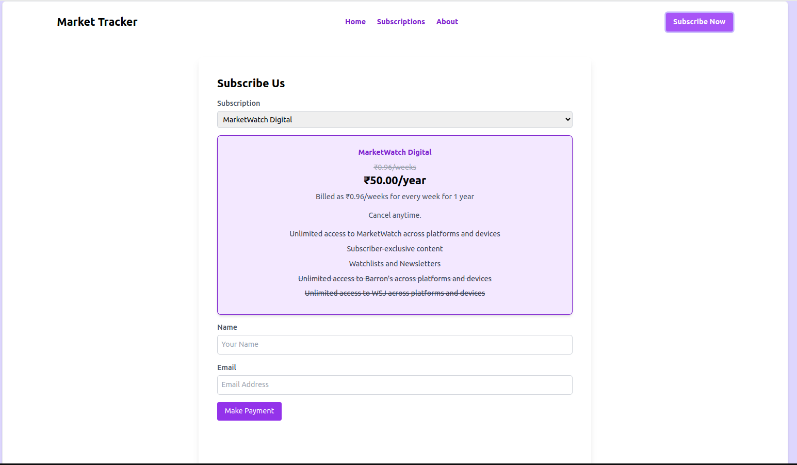
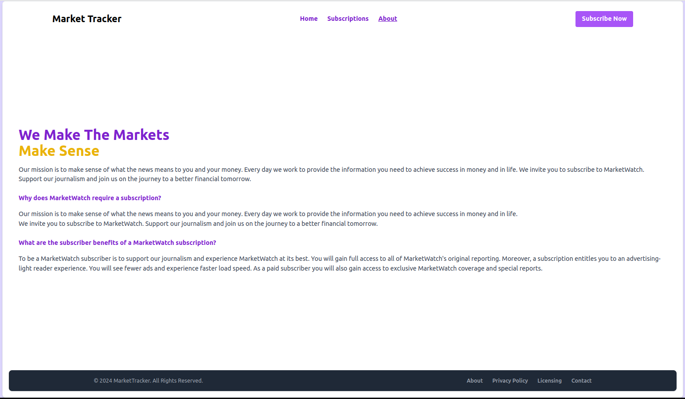

# Market Tracker Frontend with React

Market Tracker is a React-based application that provides various daily market updates to users. Users can explore subscription plans, contact the admin, and make payments securely for any subscription plan.

## Features

- **Contact Form**: Users can reach out to the admin using a contact form.
- **Subscription Plans**: Users can view and select from various subscription plans.
- **Subscription and Payment**: Users can subscribe to a plan and make payments using multiple payment methods.
- **Notifications**: Flash messages for success and error notifications.
- **Styling**: Styled using Tailwind CSS.

## Requirements

- Node.js and npm (Node Package Manager)

## Installation

1. **Clone the Repository**:
    ```sh
    git clone https://github.com/ravendra-01/market-tracker-frontend-react.git
    cd market-tracker-frontend-react
    ```

2. **Install Dependencies**:
    ```sh
    npm install
    ```

3. **Run the Application**:
    ```sh
    npm run dev
    ```

4. **Open the Application**:
    Open your browser and navigate to `http://localhost:5173` to see the application in action.

## Screenshots

### Home Page


### View Subscriptions


### Subscribe and Pay


### About


## Usage

- **Contact Admin**: Navigate to the home page and fill out the contact us form to send a message to the admin.
- **View Subscriptions**: Go to the subscription page to view available plans.
- **Subscribe and Pay**: Select a subscription plan, fill in the required details, and proceed with the payment.